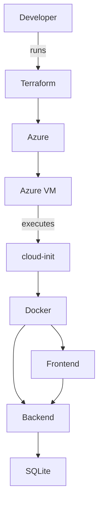
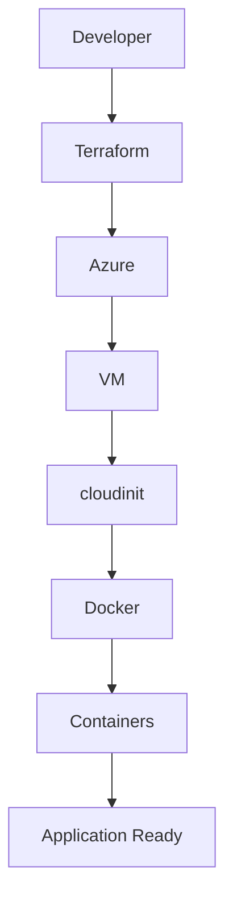

# CI/CD Pipeline Health Dashboard

## Project Overview
The CI/CD Pipeline Health Dashboard is a full-stack monitoring application that tracks GitHub Actions workflow health, build metrics, and workflow run status for a repository. It combines a FastAPI backend, a React frontend, and Docker Compose for local development, while also supporting Azure VM deployment through Terraform and cloud-init.

The solution is designed to demonstrate infrastructure-as-code, automated VM provisioning, container orchestration, health checks, and API-driven dashboard functionality.

## Features
- FastAPI backend
- React frontend
- Docker Compose orchestration
- Terraform infrastructure deployment
- Azure VM deployment
- cloud-init provisioning
- Health checks for backend and frontend containers
- GitHub Actions integration
- SQLite database persistence
- API documentation via FastAPI
- Automatic Docker deployment on VM startup

## Technology Stack
### Frontend
- React
- Vite
- Nginx

### Backend
- FastAPI
- SQLAlchemy
- SQLite
- Uvicorn

### Infrastructure
- Terraform
- Azure Resource Manager
- Azure Virtual Machine
- cloud-init

### Containerization
- Docker
- Docker Compose

### CI/CD
- GitHub Actions

Current GitHub Actions workflow:

- Backend dependency installation
- Backend tests
- Automatic workflow execution on push

Future enhancements:

- Docker image build
- Azure deployment

### Cloud
- Microsoft Azure

## Prerequisites

Before deploying, ensure the following are installed:

- Git
- Docker Desktop (for local development)
- Docker Compose
- Terraform >= 1.6
- Azure CLI
- Azure Subscription
- SSH Key Pair

## Project Structure
```
CI-CD-Dashboard/
│
├── backend/
├── frontend/
├── infra/
├── .github/
├── docker-compose.yml
├── README.md
└── .gitignore
```

## Architecture


## Deployment Workflow


## Infrastructure Components
- Resource Group: holds all Azure resources
- Virtual Network: isolates VM networking
- Subnet: places the VM in a private address range
- Network Security Group: controls inbound traffic
- Public IP: exposes the VM to the internet
- Network Interface: connects the VM to the VNet
- Linux VM: hosts Docker and the application stack

## VM Bootstrap

The Linux VM is automatically configured using cloud-init.

The bootstrap process:

- Installs Docker
- Installs Docker Compose
- Clones the GitHub repository
- Creates backend .env from .env.example
- Builds containers
- Starts the application
- Performs health checks

No manual installation is required after Terraform Apply.

## Terraform Files

provider.tf
Azure provider configuration

variables.tf
Input variables

network.tf
Networking resources

vm.tf
Linux VM and cloud-init

outputs.tf
Deployment outputs

terraform.tfvars.example
Sample deployment variables

## Local Deployment
1. Install Docker and Docker Compose.
2. Copy `backend/.env.example` to `backend/.env` and update values.
3. From the repository root, run:

```bash
docker compose up --build -d
```

4. Verify services:
- Frontend: http://localhost:3000
- Backend: http://localhost:8000
- API docs: http://localhost:8000/docs

## Azure Deployment
1. Install the Azure CLI and log in:

```bash
az login
```

2. From the `infra/` directory, initialize Terraform:

```bash
terraform init
```

3. Review the planned deployment:

```bash
terraform plan
```

4. Apply the infrastructure:

```bash
terraform apply
```

5. SSH into the VM:

```bash
ssh azureuser@<public-ip>
```

6. Verify Docker is installed:

```bash
docker version
```

7. Verify containers are running:

```bash
docker compose ps
```

8. Verify backend health:

```bash
curl http://localhost:8000/api/health
```

9. Verify frontend availability:

```bash
curl http://localhost:3000
```

Frontend:
http://<VM-PUBLIC-IP>:3000

Backend API:
http://<VM-PUBLIC-IP>:8000

Swagger UI:
http://<VM-PUBLIC-IP>:8000/docs

Health Endpoint:
http://<VM-PUBLIC-IP>:8000/api/health

## Minikube Deployment
The repository now includes Kubernetes manifests under the `k8s/` directory for local Minikube deployment.

### Prerequisites
- Minikube installed
- kubectl installed
- Docker available locally

### Start Minikube
```bash
minikube start
```

### Build local images for Minikube
From the repository root, build the backend and frontend images:

```bash
docker build -t ci-cd-backend:latest ./backend

docker build -t ci-cd-frontend:latest ./frontend
```

If your Minikube VM is using a separate Docker daemon, load the images into Minikube:

```bash
minikube image load ci-cd-backend:latest
minikube image load ci-cd-frontend:latest
```

### Deploy to Minikube
Apply the Kubernetes manifests:

```bash
kubectl apply -f k8s/namespace.yaml
kubectl apply -f k8s/storage/pvc.yaml
kubectl apply -f k8s/backend/configmap.yaml
kubectl apply -f k8s/backend/deployment.yaml
kubectl apply -f k8s/backend/service.yaml
kubectl apply -f k8s/frontend/deployment.yaml
kubectl apply -f k8s/frontend/service.yaml
kubectl apply -f k8s/frontend/ingress.yaml
```

### Verify Minikube Deployment
```bash
kubectl get pods -n ci-cd-dashboard
kubectl get svc -n ci-cd-dashboard
kubectl get ingress -n ci-cd-dashboard
```

### Access the frontend
Use Minikube to retrieve the ingress URL or add `ci-cd-dashboard.local` to `/etc/hosts`.

```bash
minikube ip
```

Open the browser to:

```bash
http://ci-cd-dashboard.local
```

### Access the backend
```bash
curl http://ci-cd-dashboard.local/api/health
```

### Cleanup
```bash
kubectl delete namespace ci-cd-dashboard
minikube stop
```


## Verification Commands
```bash
terraform output

docker ps
docker compose ps
cloud-init status
curl http://localhost:8000/api/health
curl http://localhost:3000
```

## API Endpoints
- `GET /api/health`
- `GET /api/dashboard`
- `GET /api/builds`
- `GET /api/builds/{build_id}`
- `GET /api/builds/{build_id}/logs`
- `POST /api/refresh`
- `POST /api/test-email`
- `GET /docs`
- `GET /redoc`


## Troubleshooting
### SSH Issues
- Ensure the SSH public key is present in `infra/terraform.tfvars` or provided via Terraform input.
- Confirm the VM public IP is correct.
- Verify port 22 is allowed by the Network Security Group.

### Terraform Issues
- Run `terraform init` before `terraform plan`.
- If provider registration fails, ensure the Azure subscription can create resources in the selected region.
- Use `terraform destroy` to clean up failed deployments.

### Docker Issues
- Confirm Docker is running on the VM.
- Check container logs:

```bash
docker compose logs backend
```

- Verify the frontend and backend containers are healthy.

### cloud-init Issues
- Review `/var/log/deployment.log` on the VM for bootstrap errors.
- Ensure `docker-install.sh` can detect the correct project directory and create `backend/.env`.

### Port Issues
- Confirm NSG allows ports 22, 80, 443, 3000, and 8000.
- Confirm the VM public IP is reachable.

## Cleanup
From the `infra/` directory, run:

```bash
terraform destroy
```

## Notes
- Backend configuration is loaded from `backend/.env`.
- Local development uses SQLite for persistence.
- The application includes GitHub Actions test coverage for backend code.
