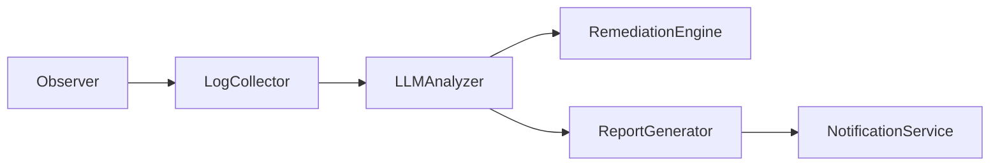

# AI Observer

This package implements an AI-native Kubernetes observer for the CI/CD Dashboard project.

## Module Purpose

- `observer.py`: Orchestrates the end-to-end monitoring workflow.
- `kubernetes_client.py`: Detects failed pods from Kubernetes state.
- `log_collector.py`: Collects pod logs and warning events.
- `llm_analyzer.py`: Sends diagnostics to an LLM for RCA generation.
- `remediation_engine.py`: Executes predefined, safe Kubernetes remediations.
- `report_generator.py`: Saves Markdown incident reports.
- `notification_service.py`: Sends incident emails with optional attachments.
- `requirements.txt`: Declares Python dependencies for the observer.

## Workflow



## Getting Started

1. Create a Python virtual environment:

```bash
python -m venv .venv
```

2. Activate it:

Windows:

```powershell
.venv\Scripts\activate
```

Linux/macOS:

```bash
source .venv/bin/activate
```

3. Install dependencies:

```bash
pip install -r requirements.txt
```

4. Copy the example environment file and provide values:

```bash
cp .env.example .env
```

5. Run the observer:

```bash
python observer.py
```

The observer requires Kubernetes access. Make sure `kubectl` is already configured for your cluster, or run it inside a Kubernetes cluster where in-cluster authentication is available.

## Environment Variables

- `OPENAI_API_KEY`: API key for the LLM provider.
- `OPENAI_MODEL`: Model name to use.
- `SMTP_HOST`: SMTP server host.
- `SMTP_PORT`: SMTP server port.
- `SMTP_USERNAME`: SMTP username.
- `SMTP_PASSWORD`: SMTP password.
- `EMAIL_FROM`: Sender address.
- `EMAIL_TO`: Recipient address.

## Notes

The observer is designed to keep running indefinitely, collect diagnostics on failed pods, and generate incident reports without stopping the monitoring loop when one stage fails.
