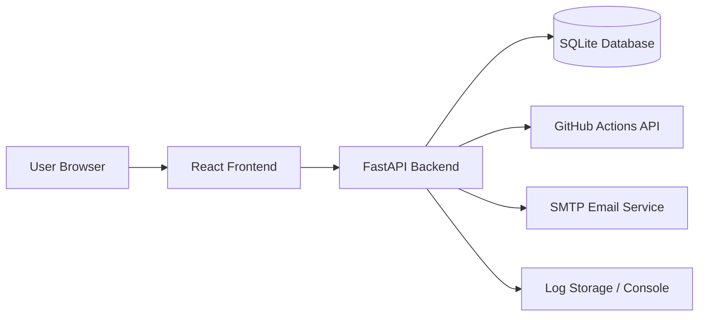
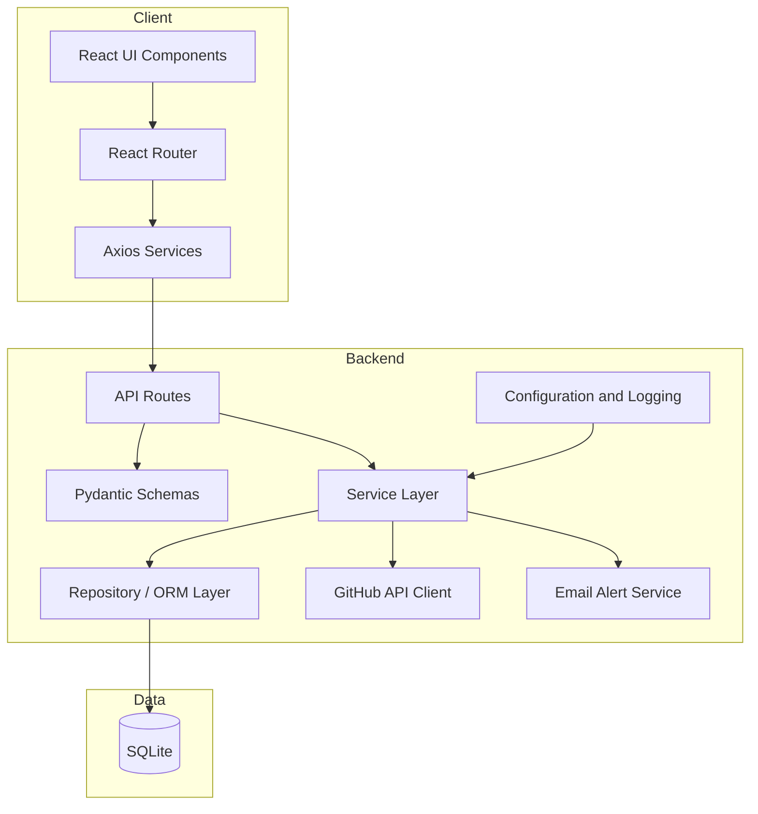
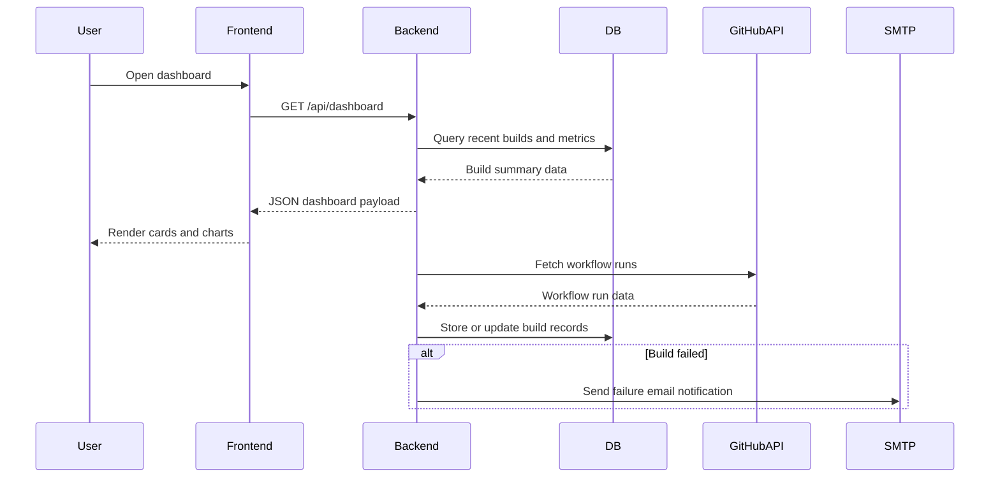
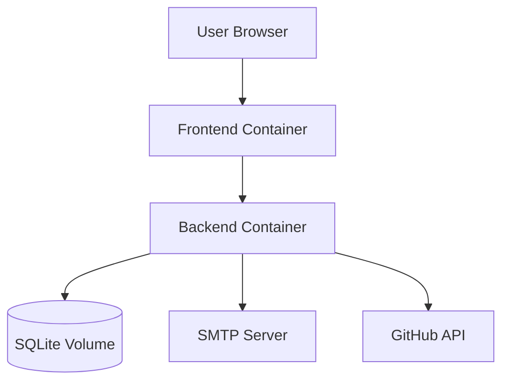

# Technical Design Document

## 1. Overview
This project will follow a modular, layered architecture to keep the CI/CD dashboard easy to evolve. The backend will handle data ingestion, persistence, metrics computation, and alerting. The frontend will provide a responsive dashboard experience. Docker Compose will orchestrate both services locally and support reproducible deployment.

## 2. High-Level Architecture


## 3. Component Diagram


## 4. Sequence Diagram


## 5. Deployment Architecture
The application will be deployed as a containerized multi-service stack using Docker Compose.

- Backend container runs the FastAPI service on port 8000.
- Frontend container serves the React UI on port 3000.
- SQLite database is stored in a local volume or mounted file path.
- Environment variables are injected into both services from a root-level .env file.



## 6. Folder Structure
```text
CI-CD-Dashboard/
├── backend/
│   ├── app/
│   │   ├── api/
│   │   ├── services/
│   │   ├── utils/
│   │   └── mail/
│   ├── requirements.txt
│   └── Dockerfile
├── frontend/
│   ├── src/
│   │   ├── components/
│   │   ├── pages/
│   │   ├── services/
│   │   ├── hooks/
│   │   └── styles/
│   ├── package.json
│   └── Dockerfile
├── docs/
├── docker/
├── .github/
├── docker-compose.yml
└── README.md
```

## 7. Database Design
The database will use SQLite for simplicity and rapid local development. The schema will center on a Builds table with one row per workflow run.

### Builds Table
| Column | Type | Description |
| --- | --- | --- |
| id | INTEGER PK | Unique identifier |
| pipeline_name | TEXT | Name of the pipeline or workflow |
| build_number | INTEGER | Build number from the CI system |
| workflow_name | TEXT | Workflow name |
| status | TEXT | Success, failure, in_progress, cancelled |
| duration | INTEGER | Duration in seconds |
| branch | TEXT | Git branch name |
| commit_id | TEXT | Git commit hash |
| commit_message | TEXT | Commit message |
| author | TEXT | Commit author |
| started_at | DATETIME | When the run started |
| completed_at | DATETIME | When the run completed |
| logs | TEXT | Build logs or a reference to logs |
| created_at | DATETIME | Record creation timestamp |

### Design Notes
- The schema is intentionally simple and normalized around a single build entity.
- Additional tables may be introduced later for repositories, workflow definitions, or alert preferences.
- Indexes will be added for status, branch, and started_at for faster analytics.

## 8. API Design
The backend will expose a REST API with clear resource-oriented endpoints.

### Endpoints
- GET /health
- GET /api/dashboard
- GET /api/builds
- GET /api/builds/{id}
- GET /api/builds/{id}/logs
- POST /api/refresh

### Response Conventions
- Success responses return JSON payloads with a consistent shape.
- Errors return a JSON object with message and optional details.
- Validation failures are surfaced with explicit field-level messages.

## 9. Technology Stack
### Backend
- Python 3.12
- FastAPI
- SQLAlchemy
- Pydantic
- SQLite
- Requests
- python-dotenv

### Frontend
- React
- Axios
- Bootstrap
- Chart.js
- React Router

### Deployment
- Docker
- Docker Compose
- GitHub Actions for CI workflow automation

## 10. Security Considerations
- GitHub personal access tokens and SMTP credentials are stored in environment variables only.
- No secrets are committed to the repository.
- API inputs are validated using Pydantic.
- The service will avoid direct SQL string concatenation and use ORM queries.
- CORS is configured narrowly for the frontend origin.
- Logging will avoid storing sensitive content such as tokens or passwords.

## 11. Logging Strategy
- Python logging will be used with structured log messages.
- Logs will be emitted to stdout so Docker containers can collect them easily.
- Request and error logs will be written for API calls and background refresh operations.
- Critical failures, such as GitHub API fetch errors or email sending failures, will be logged with sufficient context.

## 12. Error Handling Strategy
- Custom exception classes will be used for domain-specific failures.
- API endpoints will return consistent error payloads.
- Failures from GitHub API or SMTP will be caught and logged without crashing the application.
- Background refresh will retry gracefully and continue processing other builds if one import fails.

## 13. Future Scalability
The architecture is designed to evolve without a rewrite.
- The backend can later move to PostgreSQL or MySQL.
- The background sync can be moved to a worker service or scheduler.
- Metrics can be expanded to support historical trend analysis and dashboards.
- Authentication and role-based access control can be introduced later.
- A separate message queue can be introduced when ingestion volume grows.

## 14. Architectural Decisions
- A layered backend is chosen to separate API, service, and persistence concerns.
- SQLite is used first for simplicity, low operational cost, and fast setup.
- React is used for the frontend because it supports a responsive single-page experience and component reuse.
- Docker Compose is selected to make local development and deployment consistent.
- GitHub Actions API is the preferred source because it aligns with the assignment and provides workflow run metadata directly.
